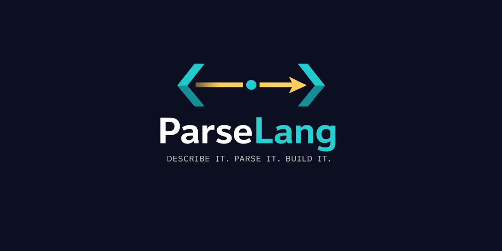

<div align="center">



[](https://discord.gg/Wb6z8Wam7p) [](https://bsky.app/profile/tinybiggames.com)

</div>

## What is ParseLang?

**ParseLang is the meta-language layer of the [Parse()](https://parsekit.org) toolkit. Write a `.parse` file. Get a compiler.**

ParseLang lets you describe a complete programming language (its tokens, grammar rules, semantic analysis, and C++23 code generation) in a single concise declarative file. The [Parse()](https://parsekit.org) toolkit reads that file, builds a live fully-configured compiler in memory, and immediately uses it to compile your source files to native binaries via Zig. No Delphi code required.

```
-- mylang.parse: a complete imperative language in one file

language MyLang;

keywords casesensitive
  'var'    -> 'keyword.var';
  'func'   -> 'keyword.func';
  'if'     -> 'keyword.if';
  'while'  -> 'keyword.while';
end

operators
  ':=' -> 'op.assign';
  '+'  -> 'op.plus';
  '-'  -> 'op.minus';
  '('  -> 'delimiter.lparen';
  ')'  -> 'delimiter.rparen';
  ';'  -> 'delimiter.semicolon';
end

binaryop 'op.plus'  power 20 op '+';
binaryop 'op.minus' power 20 op '-';

statement 'keyword.var' as 'stmt.var_decl'
  parse
    result := createNode();
    consume();
    setAttr(result, 'decl.name', current().text);
    consume();
    expect('op.assign');
    addChild(result, parseExpr(0));
    expect('delimiter.semicolon');
  end
end

emit 'stmt.var_decl'
  declVar(getAttr(node, 'decl.name'), 'int64_t', exprToString(getChild(node, 0)));
end
```

The target is always C++ 23, compiled to a native binary by Zig/Clang. You never write C++ and you never configure a build system. ParseLang generates, compiles, and optionally executes the result in a single pass.

## 🎯 Who is ParseLang For?

ParseLang is for developers who want to ship a language without building the infrastructure from scratch. If any of the following describes you, ParseLang is worth a look:

- **Language designers**: You have a syntax idea and you want to see it run as a native binary this week, not next year. ParseLang handles every stage from source text to executable. You focus on the language design.
- **DSL authors**: Build a domain-specific language for configuration, scripting, query, or automation that compiles to native code rather than being interpreted. No external runtime, no JVM, no Python dependency.
- **Compiler students**: Learn real compiler construction techniques through working code, not textbook pseudocode. Pratt parsing, scope analysis, AST enrichment, code generation, all visible and editable in a single `.parse` file.
- **Tool builders**: Build code generators, transpilers, or custom build pipelines around a language you define. ParseLang fits naturally into developer tooling and build-time workflows.

## ✨ Key Features

- 🗂️ **One file, one language**: A single `.parse` file drives every stage of the pipeline. Lexer rules, grammar handlers, semantic analysis, and C++23 emitters all live together. No separate grammar files, no parser generators, no separate build scripts.
- ⚡ **Pratt parser built in**: Top-down operator precedence parsing ships ready to use. Register `prefix`, `infix-left`, `infix-right`, and `statement` handlers. Binding powers control precedence. Use `binaryop` shorthand for standard arithmetic and comparison operators in one line each.
- 📝 **Scripting blocks with full control flow**: Handler bodies are written in a built-in Pascal-influenced scripting language. Variables, `if/else`, `while`, `for/in`, `repeat/until`, function calls, string operations, and node manipulation, all inside the `.parse` file.
- 🔬 **Semantic engine with scope trees**: Built-in symbol table with scope push/pop, symbol declaration and lookup, and error reporting. Register only the node kinds you care about; unregistered kinds are walked transparently.
- 🎯 **C++23 fluent emitter**: A structured IR builder generates well-formed C++23 text through named functions: `func`, `param`, `declVar`, `assign`, `ifStmt`, `whileStmt`, `returnVal`, `invoke`, and many more. No string-formatting C++ by hand.
- 🗺️ **Type mapping**: A `typemap` block maps your language's type kind strings to C++ types. Call `typeToIR(kind)` in any emit block to resolve them. Multiple `typemap` blocks are merged.
- 🔧 **Helper functions**: Write reusable scripting routines with typed parameters and return values. Call them from any parse, semantic, emit, or exproverride block.
- 🧩 **ExprToString with overrides**: Built-in recursive expression-to-C++ conversion handles all standard expression kinds. Register per-kind `exproverride` handlers for language-specific rendering.
- 🚀 **Full pipeline control from your language's source files**: Your language can expose `platform`, `buildmode`, `optimize`, `subsystem`, and Windows version info as first-class statements. A program written in your language declares these directly in its source, and ParseLang parses and applies them before the Zig toolchain runs. The target platform, output type, optimization level, and version resource are all driven by the source file itself, not by external build scripts.
- 🏗️ **Zig as the build backend**: Generated C++ is compiled to a native binary by Zig/Clang with no external toolchain setup required. Target Windows x64 or Linux x64. Build modes: exe, lib, dll. Optimize levels: debug, release-safe, release-fast, release-small.
- 🔒 **Two-phase lifetime safety**: Phase 1 parses your `.parse` file and builds a configured compiler. Phase 2 compiles your source with that compiler. The two phases are isolated; closures from Phase 1 safely survive into Phase 2.

## 📄 The `.parse` File

A `.parse` file consists of a `language` declaration followed by any number of sections and rules. Comments use `--`. Statements end with `;`. All blocks close with `end`.

```
language MyLang;

-- Lexer sections
keywords   ... end
operators  ... end
strings    ... end
comments   ... end
structural ... end
types      ... end
literals   ... end
typemap    ... end

-- Grammar rules
registerLiterals;
binaryop ...;
prefix    ... end
infix     ... end
statement ... end
exproverride ... end

-- Analysis and code generation
semantic  ... end
emit      ... end

-- Reusable helpers
function  ... end
```

### Lexer Sections

**keywords** declares reserved words that the lexer recognises and emits with a given token kind string instead of `identifier`. The optional modifier `casesensitive` or `caseinsensitive` controls matching.

```
keywords casesensitive
  'if'     -> 'keyword.if';
  'else'   -> 'keyword.else';
  'end'    -> 'keyword.end';
  'true'   -> 'keyword.true';
  'false'  -> 'keyword.false';
  'nil'    -> 'keyword.nil';
end
```

**operators** declares multi- and single-character operator tokens. List longer operators before shorter ones to guarantee longest-match behaviour.

```
operators
  ':=' -> 'op.assign';
  '<>' -> 'op.neq';
  '<=' -> 'op.lte';
  '>=' -> 'op.gte';
  '->' -> 'op.arrow';
  '+'  -> 'op.plus';
  '-'  -> 'op.minus';
  '('  -> 'delimiter.lparen';
  ')'  -> 'delimiter.rparen';
  ';'  -> 'delimiter.semicolon';
end
```

**strings** declares string literal styles with open/close delimiters, a token kind, and an optional `escape` flag. `escape true` processes backslash sequences; `escape false` uses the Pascal convention where two consecutive close-delimiter characters represent one literal close delimiter.

```
strings
  '"' '"' -> 'literal.string' escape true;
end
```

**comments** declares line and block comment styles.

```
comments
  line '--';
  line '//';
  block '(*' '*)';
end
```

**structural** declares the three structural token kinds the parser engine uses for block-aware parsing: the statement terminator, the block-open token, and the block-close token.

```
structural
  terminator 'delimiter.semicolon';
  blockclose 'keyword.end';
end
```

**types** declares type keyword tokens. These are registered separately so the semantic engine can resolve type text to type kind strings via `typeTextToKind()`.

```
types
  'int'    -> 'type.int';
  'string' -> 'type.string';
  'bool'   -> 'type.bool';
  'void'   -> 'type.void';
end
```

**literals** declares which AST node kinds carry literal values and what type kind they represent. Used by `InferLiteralType()` in the semantic engine.

```
literals
  'literal.integer' -> 'type.int';
  'literal.string'  -> 'type.string';
  'expr.bool'       -> 'type.bool';
end
```

**typemap** maps your language's type kind strings to C++ type strings. Multiple `typemap` blocks are merged. Call `typeToIR(kind)` in emit blocks to resolve them.

```
typemap
  'type.int'    -> 'int64_t';
  'type.string' -> 'std::string';
  'type.bool'   -> 'bool';
  'type.void'   -> 'void';
end
```

### Grammar Rules

**registerLiterals** registers the framework's built-in literal prefix handlers for integer, real, string, and char token kinds. Call this once after your lexer sections.

```
registerLiterals;
```

**binaryop** is shorthand for registering simple binary operators. One line registers both the infix parse handler and the emit handler. Use `power` to set binding power.

```
binaryop 'op.plus'    power 20 op '+';
binaryop 'op.minus'   power 20 op '-';
binaryop 'op.star'    power 30 op '*';
binaryop 'op.slash'   power 30 op '/';
binaryop 'op.eq'      power 10 op '==';
binaryop 'op.neq'     power 10 op '!=';
binaryop 'op.lt'      power 10 op '<';
binaryop 'op.gt'      power 10 op '>';
```

**prefix** fires when the parser sees the given token kind at the start of an expression. Assign the created node to `result`. The `parse` keyword opens the scripting block; the first `end` closes it and the second closes the rule.

```
prefix 'delimiter.lparen' as 'expr.grouped'
  parse
    consume();
    result := createNode();
    addChild(result, parseExpr(0));
    expect('delimiter.rparen');
  end
end

prefix 'keyword.true' as 'expr.bool'
  parse
    result := createNode();
    setAttr(result, 'bool.value', 'true');
    consume();
  end
end
```

**infix** fires when the given token kind appears between two expressions. The already-parsed left expression is available as `left`. Set associativity with `left` or `right`, and binding power with `power`.

```
infix left 'delimiter.lparen' power 80 as 'expr.call'
  parse
    result := createNode();
    setAttr(result, 'call.name', getAttr(left, 'ident.name'));
    consume();
    if not check('delimiter.rparen') then
      addChild(result, parseExpr(0));
      while match('delimiter.comma') do
        addChild(result, parseExpr(0));
      end
    end
    expect('delimiter.rparen');
  end
end
```

**statement** fires when the given token kind appears at the start of a statement position.

```
statement 'keyword.var' as 'stmt.var_decl'
  parse
    result := createNode();
    consume();
    setAttr(result, 'decl.name', current().text);
    consume();
    expect('delimiter.colon');
    setAttr(result, 'decl.type_text', current().text);
    consume();
    expect('op.assign');
    addChild(result, parseExpr(0));
    expect('delimiter.semicolon');
  end
end
```

**exproverride** overrides how a specific node kind is rendered to a C++ expression string by `exprToString()`. The implicit variable `node` is the AST node being rendered; assign the C++ text to `result`.

```
exproverride 'expr.negate'
  override
    result := '-' + exprToString(getChild(node, 0));
  end
end
```

### Semantic Rules

Semantic rules fire during the analysis pass when a node of the given kind is visited. Use them to manage scope, declare and resolve symbols, infer types, and report errors.

```
semantic 'program.root'
  pushScope('global', node);
  visitChildren(node);
  popScope(node);
end

semantic 'stmt.var_decl'
  ok := declare(getAttr(node, 'decl.name'), node);
  if not ok then
    error(node, 'ML001', 'Duplicate variable: ' + getAttr(node, 'decl.name'));
  end
  setAttr(node, 'sem.type', typeTextToKind(getAttr(node, 'decl.type_text')));
  visitChildren(node);
end

semantic 'expr.ident'
  sym := lookup(getAttr(node, 'ident.name'));
  if sym = nil then
    error(node, 'ML003', 'Undeclared identifier: ' + getAttr(node, 'ident.name'));
  end
end
```

### Emit Rules

Emit rules fire during code generation when a node of the given kind is walked. Statement nodes call IR builder procedures directly. Expression nodes assign their C++ text to `result`.

```
emit 'program.root'
  setPlatform('win64');
  setBuildMode('exe');
  include('cstdint', target.header);
  include('cstdio',  target.header);
  func('main', 'int');
  emitChildren(node);
  returnVal('0');
  endFunc();
end

emit 'stmt.var_decl'
  declVar(getAttr(node, 'decl.name'),
          resolveType(getAttr(node, 'decl.type_text')),
          exprToString(getChild(node, 0)));
end

emit 'stmt.if'
  cond := exprToString(getChild(node, 0));
  ifStmt(cond);
  emitBlock(getChild(node, 1));
  if childCount(node) > 2 then
    elseStmt();
    emitBlock(getChild(node, 2));
  end
  endIf();
end

emit 'expr.call'
  fname := getAttr(node, 'call.name');
  args := '';
  i := 0;
  while i < childCount(node) do
    if i > 0 then
      args := args + ', ';
    end
    args := args + exprToString(getChild(node, i));
    i := i + 1;
  end
  result := fname + '(' + args + ')';
end
```

### Helper Functions

Helper functions are reusable scripting routines callable from any parse, semantic, emit, or exproverride block. Parameter types are enforced at call time: passing the wrong type or the wrong number of arguments reports a semantic error and stops execution immediately.

```
function resolveType(typeText: string) -> string
  result := typeToIR(typeTextToKind(typeText));
end

function emitBlock(blk: node)
  i := 0;
  while i < childCount(blk) do
    emitNode(getChild(blk, i));
    i := i + 1;
  end
end
```

### The Scripting Language

All handler bodies use a built-in Pascal-influenced scripting language. Variables are declared implicitly on first assignment.

**Control flow:**

```
-- if / else if / else / end
if x > 10 then
  emitLine('big');
else if x > 5 then
  emitLine('medium');
else
  emitLine('small');
end

-- while / do / end
i := 0;
while i < childCount(node) do
  emitNode(getChild(node, i));
  i := i + 1;
end

-- for / in / do / end  (iterates 0 to N-1)
for i in childCount(node) do
  emitNode(getChild(node, i));
end

-- repeat / until
repeat
  tok := consume();
until tok.kind = 'delimiter.semicolon';
```

**Operators:** `+` `-` `*` for arithmetic and string concatenation; `=` `<>` `<` `>` `<=` `>=` for comparison; `and` `or` `not` for logic.

**Implicit variables by context:**

| Context | Variable | Description |
|---|---|---|
| `prefix` / `statement` | `result` | Assign the created AST node here |
| `infix` | `result` | Assign the created AST node here |
| `infix` | `left` | The already-parsed left operand |
| `semantic` | `node` | The AST node being analysed |
| `emit` | `node` | The AST node being emitted |
| `emit` | `result` | Assign C++23 expression text here |
| `emit` | `target` | Use `.source` / `.header` for IR output target |
| `exproverride` | `node` | The AST node being rendered |
| `exproverride` | `result` | Assign the C++ expression text |

## 🚀 Pipeline Configuration from Source

One of ParseLang's most powerful capabilities is that your language can expose build configuration as first-class statements in the source language itself. The target platform, build mode, optimize level, Windows subsystem, and full Windows version resource info are all declarable directly in a program written in your language. ParseLang parses them, applies them to the pipeline, and passes them to the Zig toolchain before the build runs.

This means a source file written in your language can fully own its own build output, with no external build scripts, no make files, and no IDE project settings required.

You wire this up in your `.parse` file by defining grammar statements for each configuration keyword, then writing emit handlers that call the corresponding pipeline built-ins:

```
-- In mylang.parse: declare the grammar rules
statement 'keyword.platform' as 'stmt.set_platform'
  parse
    result := createNode();
    consume();
    setAttr(result, 'pipeline.value', current().text);
    consume();
    expect('delimiter.semicolon');
  end
end

statement 'keyword.buildmode' as 'stmt.set_buildmode'
  parse
    result := createNode();
    consume();
    setAttr(result, 'pipeline.value', current().text);
    consume();
    expect('delimiter.semicolon');
  end
end

-- Wire them to pipeline built-ins in the emit handlers
emit 'stmt.set_platform'
  setPlatform(getAttr(node, 'pipeline.value'));
end

emit 'stmt.set_buildmode'
  setBuildMode(getAttr(node, 'pipeline.value'));
end
```

A program written in that language then sets its own build target at the top of the source file:

```
-- hello.ml: the source file declares its own build configuration
platform win64;
buildmode exe;
optimize debug;
subsystem console;
```

The same approach applies to Windows version info. Expose `viEnabled`, `viMajor`, `viMinor`, `viPatch`, `viProductName`, `viDescription`, `viFilename`, `viCompanyName`, and `viCopyright` as language statements, wire their emit handlers to the `viEnabled()`, `viMajor()`, `viProductName()` etc. pipeline built-ins, and the compiled binary gets version resources embedded automatically:

```
-- hello.ml: version info declared in the source language
viEnabled true;
viExeIcon "res/assets/icons/myapp.ico";
viMajor 1;
viMinor 0;
viPatch 0;
viProductName "My App";
viDescription "Built with ParseLang";
viFilename "myapp.exe";
viCompanyName "ACME Corp";
viCopyright "Copyright 2025 ACME Corp";
```

**Pipeline built-ins available in emit blocks:**

| Built-in | Values | Description |
|---|---|---|
| `setPlatform(p)` | `'win64'`, `'linux64'` | Target platform |
| `setBuildMode(m)` | `'exe'`, `'lib'`, `'dll'` | Output type |
| `setOptimize(o)` | `'debug'`, `'release'`, `'speed'`, `'size'` | Optimisation level |
| `setSubsystem(s)` | `'console'`, `'gui'` | Windows subsystem |
| `setOutputPath(p)` | any string | Override output directory |
| `viEnabled(v)` | `'true'`, `'false'` | Enable Windows version resource |
| `viExeIcon(path)` | file path string | Embed icon into the executable |
| `viMajor(v)` | integer string | Version major number |
| `viMinor(v)` | integer string | Version minor number |
| `viPatch(v)` | integer string | Version patch number |
| `viProductName(v)` | string | Product name in version resource |
| `viDescription(v)` | string | File description in version resource |
| `viFilename(v)` | string | Original filename in version resource |
| `viCompanyName(v)` | string | Company name in version resource |
| `viCopyright(v)` | string | Copyright string in version resource |

Caller-supplied `SetTargetPlatform()` / `SetBuildMode()` / `SetOptimizeLevel()` values are applied as defaults before Phase 1 runs. Pipeline calls in emit blocks override those defaults at source level.

## 💡 A Complete Example

The `bin/tests/` directory contains a working language definition and program. `mylang.parse` defines a small imperative language that exercises every major feature of the ParseLang framework: lexer, grammar, semantic analysis, code generation, and full source-level pipeline configuration.

**bin/tests/hello.ml** is a complete program written in MyLang, including its own build configuration:

```
-- hello.ml — MyLang test program
-- Exercises: functions, var decls, assignment, if/else, while, print, return

-- Pipeline configuration (source-level, overrides Delphi compile-time defaults)
platform win64;
buildmode exe;
optimize debug;
subsystem console;

-- Version info
viEnabled true;
viExeIcon "res/assets/icons/parselang.ico";
viMajor 1;
viMinor 0;
viPatch 0;
viProductName "Hello";
viDescription "MyLang Hello World";
viFilename "hello.exe";
viCompanyName "ParseLang";
viCopyright "Copyright 2025 ParseLang";

func add(a: int, b: int) -> int
  return a + b;
end

func clamp(v: int, lo: int, hi: int) -> int
  if v < lo then
    return lo;
  end
  if v > hi then
    return hi;
  end
  return v;
end

var x: int := 10;
var y: int := 32;
var result: int := add(x, y);

print(result);

if result > 40 then
  print(1);
else
  print(0);
end

var i: int := 5;
while i > 0 do
  i := i - 1;
end

print(clamp(x, 3, 8));
print(clamp(100, 3, 8));
print(clamp(-5, 3, 8));
```

**Compile and run using the PLC CLI:**

```
PLC -l bin/tests/mylang.parse -s bin/tests/hello.ml -o bin/output -r
```

**Expected output:**

```
42
1
8
8
3
```

## 🛠️ The PLC Command-Line Tool

`PLC.exe` is the ParseLang command-line compiler. It takes a language definition and a source file and drives the full two-phase compilation pipeline.

```
PLC -l <lang-file> -s <source-file> [options]
```

| Flag | Long form | Description |
|---|---|---|
| `-l <file>` | `--lang <file>` | Language definition file (`.parse`) |
| `-s <file>` | `--source <file>` | Source file to compile |
| `-o <path>` | `--output <path>` | Output path (default: `output`) |
| `-nb` | `--no-build` | Generate C++ sources only, skip binary build |
| `-r` | `--autorun` | Build and immediately run the compiled binary |
| `-h` | `--help` | Display help |

**Examples:**

```
-- Compile and build
PLC -l mylang.parse -s hello.ml -o build

-- Compile, build, and run
PLC -l mylang.parse -s hello.ml -o build -r

-- Generate sources only, no Zig invocation
PLC -l mylang.parse -s hello.ml -o build -nb
```

## 🔌 Using TParseLang from Delphi

Add `ParseLang.pas` and its companion units to your project. The `TParseLang` class drives both phases.

```delphi
uses
  ParseLang;

var
  LPL: TParseLang;
begin
  LPL := TParseLang.Create();
  try
    // Phase 1: point at the .parse language definition
    LPL.SetLangFile('bin/tests/mylang.parse');

    // Phase 2: point at the user's source file
    LPL.SetSourceFile('bin/tests/hello.ml');

    // Output directory for generated files and binary
    LPL.SetOutputPath('bin/output');

    // Build defaults (can be overridden from inside the .parse file or source)
    LPL.SetTargetPlatform(tpWin64);
    LPL.SetBuildMode(bmExe);
    LPL.SetOptimizeLevel(olDebug);
    LPL.SetSubsystem(stConsole);

    // Wire status output
    LPL.SetStatusCallback(
      procedure(const ALine: string; const AUserData: Pointer)
      begin
        WriteLn(ALine);
      end);

    // ABuild=True  -> invoke Zig toolchain -> native binary
    // AAutoRun=True -> run binary after build
    if LPL.Compile(True, False) then
    begin
      WriteLn('Build OK');
      LPL.Run();
    end
    else
    begin
      WriteLn('Build failed.');
      // LPL.GetErrors() returns errors from whichever phase failed
      // LPL.HasErrors() indicates whether any errors exist
    end;
  finally
    LPL.Free();
  end;
end;
```

**Required units in your project:**

- `ParseLang.pas`
- `ParseLang.Lexer.pas`
- `ParseLang.Grammar.pas`
- `ParseLang.Semantics.pas`
- `ParseLang.CodeGen.pas`

**TParseLang API reference:**

| Method | Description |
|---|---|
| `SetLangFile(filename)` | Path to the `.parse` language definition file |
| `SetSourceFile(filename)` | Path to the source file to compile |
| `SetOutputPath(path)` | Directory for generated files and the native binary |
| `SetTargetPlatform(platform)` | Default build platform (overridable from source) |
| `SetBuildMode(mode)` | Default build mode (overridable from source) |
| `SetOptimizeLevel(level)` | Default optimize level (overridable from source) |
| `SetSubsystem(subsystem)` | Windows subsystem type |
| `SetLineDirectives(enabled)` | Emit `#line` directives in generated C++ |
| `SetStatusCallback(cb, data)` | Callback for status/progress messages |
| `SetOutputCallback(cb, data)` | Callback for program output capture |
| `Compile(build, autoRun)` | Run Phase 1 + Phase 2; returns True on success |
| `Run()` | Run the last successfully compiled binary |
| `GetLastExitCode()` | Exit code from the last `Run()` call |
| `HasErrors()` | True if the last `Compile()` produced errors |
| `GetErrors()` | Error collection from the last phase that ran |
| `GetVersionStr()` | ParseLang version string |

## 🚀 Getting Started

### Step 1: Download the Latest ParseLang Release

The ParseLang release is self-contained. It includes the PLC compiler, all pre-built binaries, and the Zig toolchain. This is all you need to compile `.parse` files immediately. No Delphi installation required.

**[⬇️ Download the latest ParseLang release](https://github.com/tinyBigGAMES/ParseLang/releases/latest)**

Unzip into a folder of your choice. Then run the included example:

```
bin\PLC.exe -l bin\tests\mylang.parse -s bin\tests\hello.ml -o bin\output -r
```

### Step 2: Build from Source (Optional)

To build from source, unzip the ParseKit and ParseLang sources side by side under the same root folder:

```
[root]
  ParseKit\    <- ParseKit sources
  ParseLang\   <- ParseLang sources
```

The toolchain is already included in the ParseLang release from Step 1, so no additional downloads are needed.

**[⬇️ Download ParseKit source](https://github.com/tinyBigGAMES/ParseKit/archive/refs/heads/main.zip)**

**[⬇️ Download ParseLang source](https://github.com/tinyBigGAMES/ParseLang/archive/refs/heads/main.zip)**

Then open the ParseLang project group in Delphi and build.

#### System Requirements

| | Requirement |
|---|---|
| **Host OS** | Windows 10/11 x64 |
| **Linux target** | WSL2 + Ubuntu (`wsl --install -d Ubuntu`) |
| **Delphi** | Delphi 11 Alexandria or later (source builds only) |

### WSL Setup (One Time)

To build and run Linux binaries from a Windows host, install WSL2 with Ubuntu:

```powershell
wsl --install -d Ubuntu
```

Then inside WSL, install the base build tools:

```bash
sudo apt update && sudo apt install build-essential
```

That is the full setup. ParseLang locates WSL automatically and routes stdout/stderr back to your terminal.

## 🎯 Build Targets and Modes

### Target Platforms

| Target | Constant | Source keyword | Status |
|---|---|---|---|
| Windows x64 | `tpWin64` | `platform win64;` | Supported |
| Linux x64 | `tpLinux64` | `platform linux64;` | Supported (native; via WSL2 on Windows) |

### Build Modes

| Mode | Constant | Source keyword | Output |
|---|---|---|---|
| Executable | `bmExe` | `buildmode exe;` | Standalone `.exe` / ELF binary |
| Static library | `bmLib` | `buildmode lib;` | `.lib` / `.a` archive |
| Shared library | `bmDll` | `buildmode dll;` | `.dll` / `.so` |

### Optimize Levels

| Level | Constant | Source keyword | Use Case |
|---|---|---|---|
| Debug | `olDebug` | `optimize debug;` | Development: fast builds, full debug info |
| Release Safe | `olReleaseSafe` | `optimize release;` | Production: optimized with safety checks |
| Release Fast | `olReleaseFast` | `optimize speed;` | Maximum performance |
| Release Small | `olReleaseSmall` | `optimize size;` | Minimum binary size |

## 📖 Documentation

| Document | Description |
|---|---|
| [ParseLang Reference](docs/ParseLang.md) | Complete reference for every section, rule, built-in function, scripting construct, and pipeline option. Includes a full MiniCalc example, token kind conventions, node kind conventions, and known limitations. |

## 🤝 Contributing

ParseLang is an open project. Whether you are fixing a bug, improving documentation, adding a new showcase language, or proposing a framework feature, contributions are welcome.

- **Report bugs**: Open an issue with a minimal reproduction. The smaller the example, the faster the fix.
- **Suggest features**: Describe the use case first, then the API shape you have in mind. Features that emerge from real problems get traction fastest.
- **Submit pull requests**: Bug fixes, documentation improvements, new language examples, and well-scoped features are all welcome. Keep changes focused.
- **Add a language**: A new `.parse` file that demonstrates a meaningful capability is a valuable contribution.

Join the [Discord](https://discord.gg/Wb6z8Wam7p) to discuss development, ask questions, and share what you are building.

## 💙 Support the Project

ParseLang is built in the open. If it saves you time or sparks something useful:

- ⭐ **Star the repo**: it costs nothing and helps others find the project
- 🗣️ **Spread the word**: write a post, mention it in a community you are part of
- 💬 **[Join us on Discord](https://discord.gg/Wb6z8Wam7p)**: share what you are building and help shape what comes next
- 💖 **[Become a sponsor](https://github.com/sponsors/tinyBigGAMES)**: sponsorship directly funds time spent on the toolkit, documentation, and showcase languages

## 📄 License

ParseLang is licensed under the **Apache License 2.0**. See [LICENSE](https://github.com/tinyBigGAMES/ParseLang/tree/main?tab=License-1-ov-file#readme) for details.

Apache 2.0 is a permissive open source license that lets you use, modify, and distribute ParseLang freely in both open source and commercial projects. You are not required to release your own source code. You can embed ParseLang into a proprietary product, ship it as part of a commercial tool, or build a closed-source language on top of it without restriction.

The license includes an explicit patent grant, meaning contributors cannot later assert patent claims against you for using their contributions. Attribution is required: keep the copyright notice and license file in place. Beyond that, ParseLang is yours to build with.

## 🔗 Links

- [parselang.org](https://parselang.org)
- [parsekit.org](https://parsekit.org)
- [Discord](https://discord.gg/Wb6z8Wam7p)
- [Bluesky](https://bsky.app/profile/tinybiggames.com)
- [tinyBigGAMES](https://tinybiggames.com)

<div align="center">

**ParseLang™** - Describe It. Parse It. Build It.

Copyright © 2025-present tinyBigGAMES™ LLC
All Rights Reserved.

</div>
